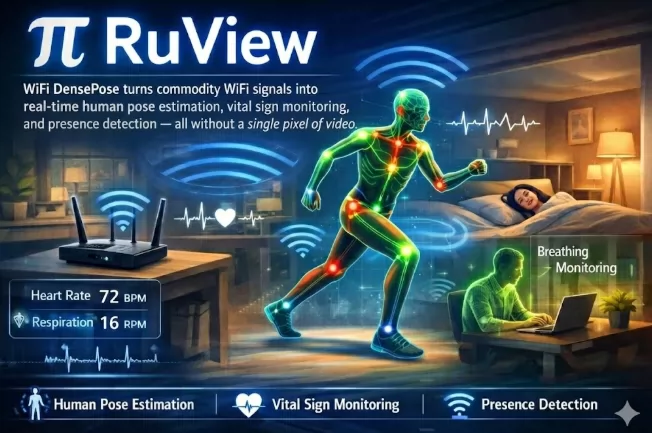

## Body

GitHub High-Star Project Sharing | RuView WiFi Human Perception

System Source Code

The GitHub project "48k + Star Black Technology" RuView, which does not require a camera or wearable device, can achieve human posture tracking, respiratory / heart rate monitoring, and wall penetration perception through WiFi signals!

Core Features:
-----No Camera 3D Posture Reconstruction (17 body keypoints)
-----Non-contact respiratory and heart rate measurement (sleep / health monitoring)
-----Wall penetration perception (deepest up to 5 meters)
-----Local edge AI computation without cloud services, strong privacy
-----Low cost ESP32 hardware deployment

Included Content:
-----Official GitHub content
-----CSI signal processing + AI model files
-----Test data + visualization tools
-----Suitable for: Internet of Things developers, AI enthusiasts, smart home / health monitoring projects research.

Electronic virtual products sold are non-refundable.

## Images

item_1045205198954

Here is a pay link on Stripe ( https://buy.stripe.com/3cs8yP7sY87d0vu9AB ). Please contact me lonlonago@foxmail.com after funding $89, and I will send you a complete data files , thank you!

